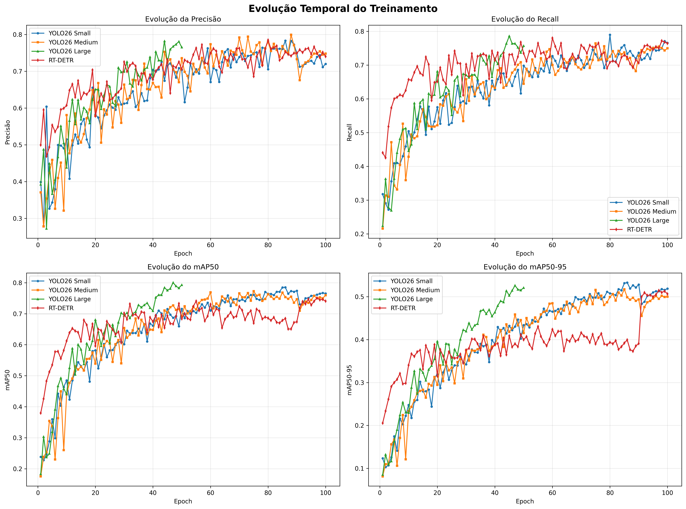
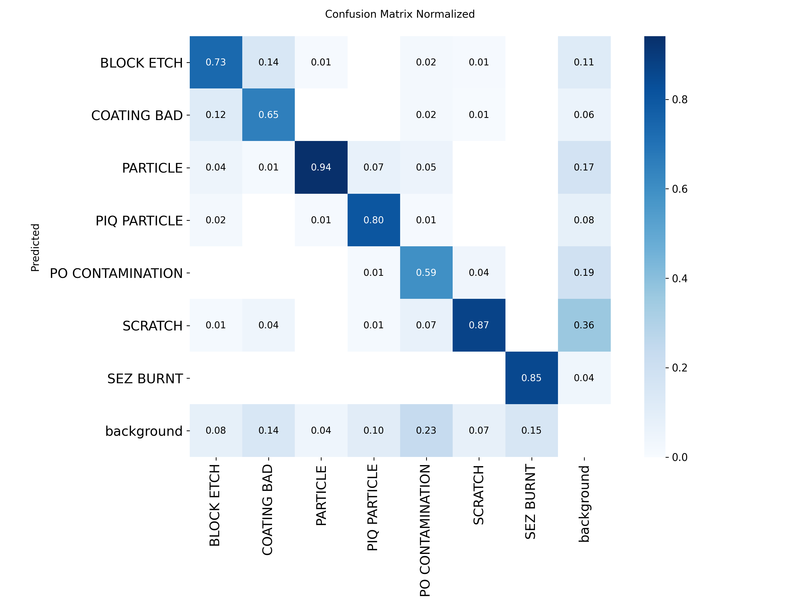
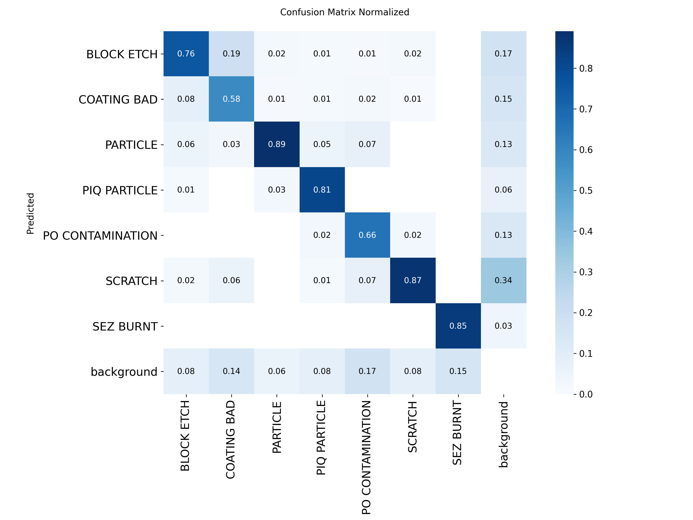
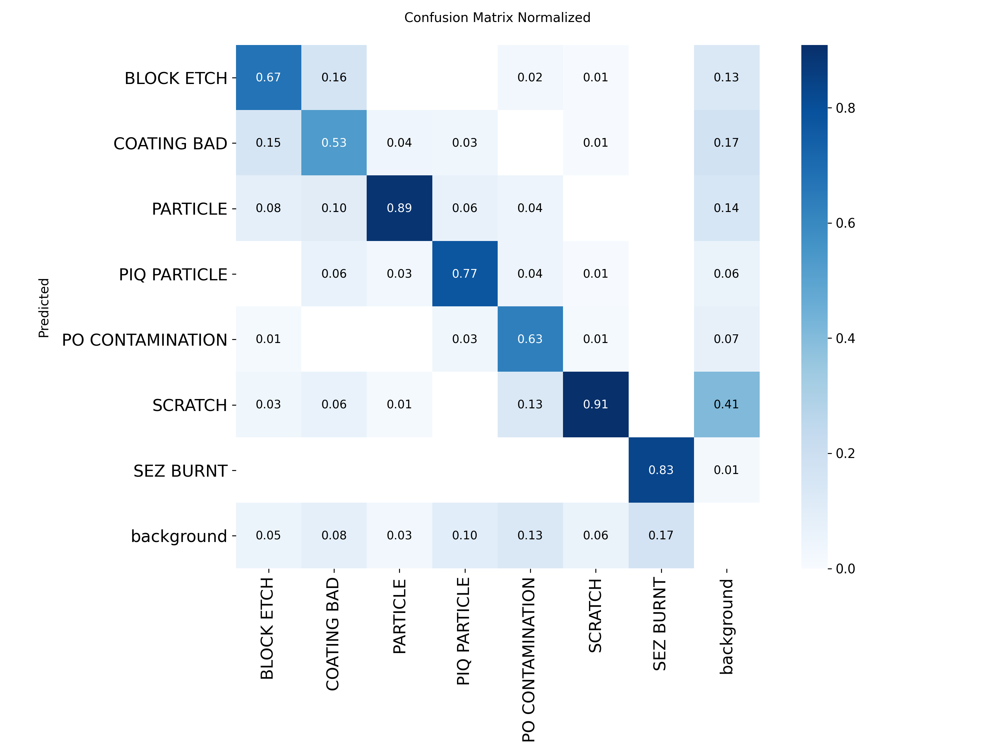
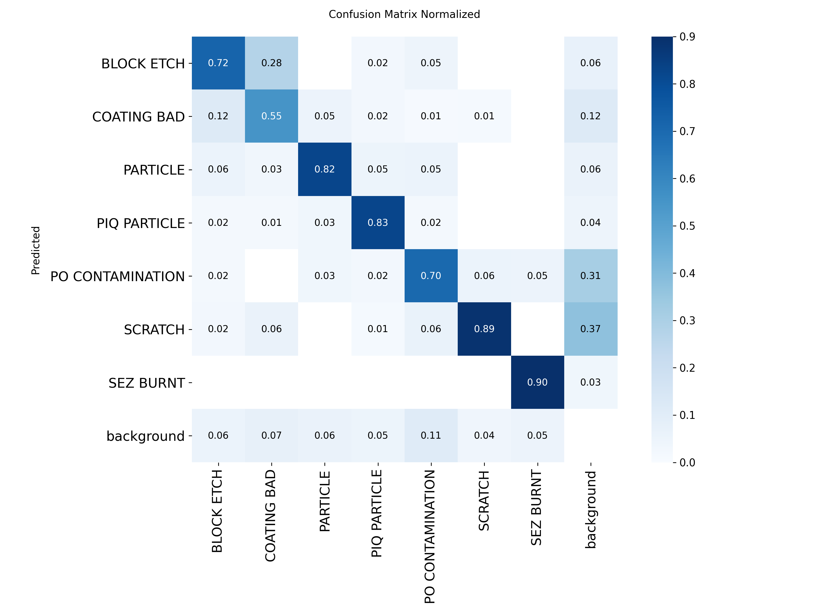
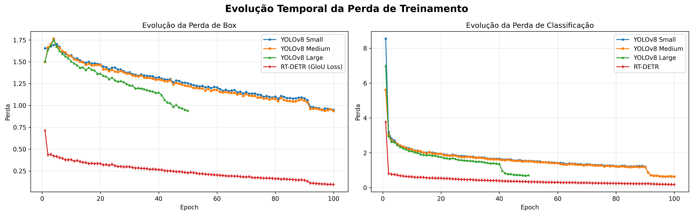

# Wafer-Defect-Computer-Vision-Model
## Trabalho de conclusão de disiciplina de Visão Computacional.

## Félix Luiz G. Filho | Maria Clara P. da S. Chaves

# Introdução:
<!-- introdução: Apresentação clara do problema abordado e da aplicação
desenvolvida. -->   
**Este trabalho tem como objetivo a aplicação de modelos e técnicas de visão computacional para a detecção de defeitos em wafers de semicondutores, experimentando e comparando abordagens diversas para a análise do problema. Além disso, será desenvolvida uma interface web (via streamlit), para que seja possível a inferência posterior de imagens, podendo ser utilizados qualquer um dos modelos treinados previamente.**

# Desenvolvimento:
<!-- Desenvolvimento / Técnicas Utilizadas: Descrição detalhada das técnicas,
algoritmos e métodos utilizados para resolver o problema -->
## Dataset

Este projeto utiliza o **Wafer Defect Dataset**, um conjunto de dados público focado na inspeção de semicondutores, disponível na plataforma [Roboflow Universe](https://universe.roboflow.com/) sob a licença **CC BY 4.0**.

### Características Técnicas
* **Tarefa:** Instance Segmentation.
* **Volume Total:** 4.532 imagens de wafers anotadas.
* **Resolução de Entrada:** Imagens redimensionadas para **768 × 768 pixels** (múltiplo de 32), resolução otimizada para preservar os detalhes microscópicos de defeitos de pequena área.

### Divisão do Dataset (Split)
O conjunto de dados foi dividido de forma balanceada para o treino e validação do modelo:
* **Treino (Train):** 3.172 imagens (~70%)
* **Validação (Val):** 907 imagens (~20%)
* **Teste (Test):** 453 imagens (~10%)

### Classes de Defeitos (7)
O modelo foi treinado para identificar e segmentar as seguintes falhas industriais:

* **Block Etch:** Remoção incompleta de material devido ao bloqueio do plasma por polímeros. Surge como manchas de bordas abruptas.
* **Coating Bad:** Irregularidades no revestimento químico (estrias ou microporos). É a classe mais desafiadora devido ao baixo contraste.
* **Particle:** Detritos externos (poeira/fragmentos) acumulados no manuseio que podem causar curtos-circuitos.
* **PIQ Particle:** Resíduos de polímeros de poliimida pós-fotolitografia, com morfologia irregular característica.
* **PO Contamination:** Contaminação química por fósforo-oxigênio, apresentando sinal óptico fraco e difícil deteção.
* **Scratch:** Riscos lineares causados por atrito mecânico (robôs/cassetes), gerando alta perda de rendimento (*yield loss*).
* **SEZ Burnt:** Marcas de queima térmica na zona de borda do wafer (*Semiconductor Edge Zone*) resultantes de falhas na cura.

## Arquitetura dos Modelos

Para este projeto, exploramos e comparamos diferentes abordagens de Deep Learning voltadas para Visão Computacional, combinando Redes Convolucionais (CNNs) e Vision Transformers (ViTs):

* **YOLO26 (`small`, `medium`, `large`):** Rede neural convolucional de última geração para detecção e segmentação de instâncias. Testamos diferentes escalas de tamanho do modelo para encontrar o equilíbrio ideal entre precisão (`mAP`) e velocidade de processamento (`FPS`) na linha de produção.
* **RT-DETR (Real-Time Detection Transformer):** Um modelo inovador baseado em *Vision Transformers (ViT)* focado em processamento em tempo real. Ele utiliza mecanismos de atenção para analisar o contexto global do wafer, eliminando etapas pesadas de pós-processamento.
* **U-Net:** Arquitetura convolucional consagrada para segmentação semântica. Foi implementada estrategicamente para gerar máscaras binárias precisas, isolando o formato exato das regiões afetadas pelos defeitos na superfície do silício.

## Estratégia de treinamento:
### Estratégia Avançada de Data Augmentation para o YOLO
Para combater o desbalanceamento de classes e a alta similaridade entre defeitos químicos e texturais (como `Coating Bad` e `SEZ Burnt`), foi aplicado um pipeline robusto de aumentação de dados:
* **Invariância Rotacional (`degrees=90.0`, `flipud=0.5`, `fliplr=0.5`):** Aplica rotações de até 90° e espelhamentos verticais/horizontais para simular wafers em qualquer orientação na linha de inspeção.
* **Mixup (`mixup=0.15`):** Mescla duas imagens distintas durante o treino, forçando a rede a aprender características de textura de forma contínua e menos linear.
* **Copy-Paste (`copy_paste=0.3`):** Recorta anotações de defeitos de uma imagem e as cola sobre o fundo de outra, multiplicando o contexto visual de classes raras.
* **Random Erasing (`erasing=0.4`):** Oclui aleatoriamente partes da imagem com blocos sólidos, obrigando o modelo a reconhecer o defeito mesmo quando parcialmente obstruído.

### Otimizações e Hiperparâmetros Avançados
* **Decaimento em Cosseno (`cos_lr=True`):** Modula a taxa de aprendizado através de um *Cosine Learning Rate Scheduler*, suavizando a convergência nas épocas finais para um ajuste fino dos pesos.
* **Máscaras de Alta Resolução (`retina_masks=True`):** Força o cálculo da segmentação na resolução nativa da imagem (sem downsampling), garantindo contornos limpos e geométricos para defeitos complexos como o `Scratch`.

# Resultados:
<!-- Resultados: Apresentação dos resultados obtidos, incluindo métricas de
desempenho, análise crítica e conclusões. -->

## Imagens do projeto

### Comparação entre modelos

Figura: comparação visual do desempenho dos modelos avaliados, incluindo as versões YOLO26 Small, Medium e Large, além do modelo RT-DETR/Transformer e do U-Net.

### Matrizes de confusão

#### YOLO26 Small

#### YOLO26 Medium

#### YOLO26 Large

#### RT-DETR / Transformer

### Curva de perda de treinamento

Figura: evolução da perda durante o treinamento do modelo principal utilizado no projeto.

